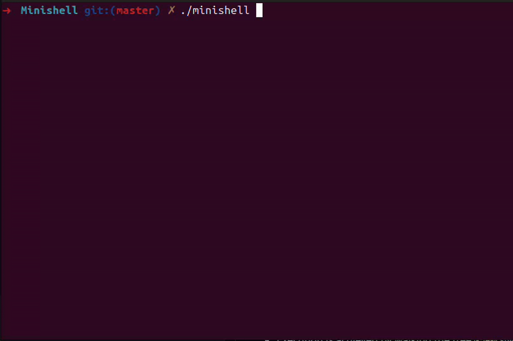

# Minishell

A Unix shell implemented in C with parsing, pipelines, redirections, environment expansion, built-ins, and process management.


## Why this project matters

Minishell demonstrates core Unix systems programming concepts in a concrete, user-facing program. It required building a parser, managing processes and file descriptors, implementing pipelines and redirections, handling signals, and reproducing expected shell behavior while keeping memory and runtime behavior under control.

## Project in action



## Quick start

Install dependencies:

```bash
sudo apt update
sudo apt install build-essential libreadline-dev
```

Build and run:

```bash
make
./minishell
```

## Usage

Launch the shell:

```bash
./minishell
```

Example commands:

```bash
echo hello world
pwd
export TEST=42
echo $TEST
ls -l | grep minishell
cat < Makefile | wc -l > outfile
```

Interactive behavior:

- `Ctrl-C` shows a new prompt
- `Ctrl-D` exits the shell
- `Ctrl-\` is ignored

## Supported features

- Interactive prompt with command history
- Command resolution through `PATH`, relative paths, and absolute paths
- Single and double quote handling
- Environment variable expansion, including `$?`
- Redirections: `<`, `>`, `>>`, `<<`
- Pipelines with `|`
- Built-ins: `echo`, `cd`, `pwd`, `export`, `unset`, `env`, `exit`
- Signal handling for interactive mode

## Technical overview

At a high level, Minishell:

1. reads user input through Readline;
2. tokenizes and parses the command line into an execution tree;
3. represents commands, pipes, and redirections as structured nodes;
4. expands environment variables and resolves command paths;
5. configures pipes and file descriptor redirections;
6. executes built-ins directly where appropriate;
7. forks child processes for external commands and pipeline stages;
8. waits on child processes and propagates exit status.

The shell uses a recursive descent parser and executes the resulting command tree recursively, creating child processes as needed.